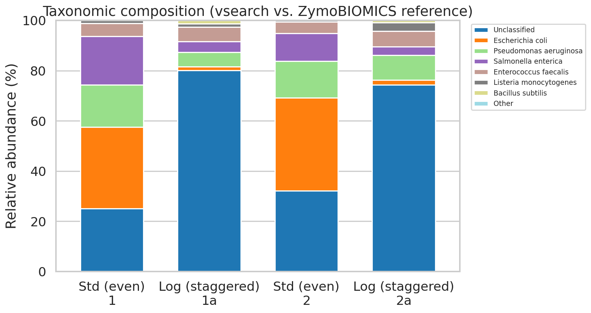
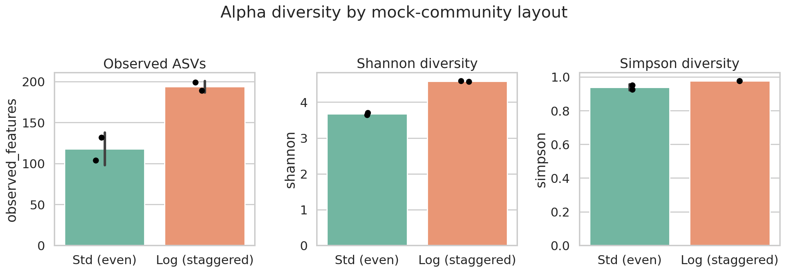
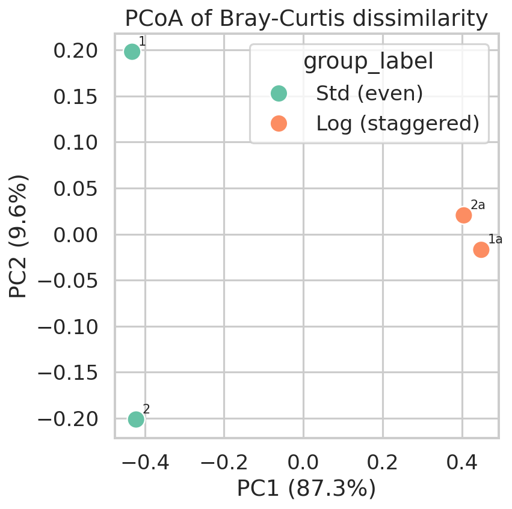

# 16S rRNA Microbial Community Analysis Pipeline

A complete, reproducible bioinformatics pipeline for 16S rRNA amplicon
sequencing data — from raw FASTQ download to diversity statistics and
figures built entirely on real, publicly available sequencing data.


---

## 1. Dataset

This pipeline analyzes real paired-end MiSeq 16S rRNA (V4 region, 515F/806R
primers) sequencing reads of the ZymoBIOMICS Microbial Community Standard
(catalog D6305/D6311) — a defined mock community of 8 bacterial and 2 fungal
species with a known genomic-DNA composition, commonly used to benchmark
amplicon pipelines.

| | |
|---|---|
| Source | [nf-core/test-datasets](https://github.com/nf-core/test-datasets) (`ampliseq` branch) — the real CI test data for the peer-reviewed [nf-core/ampliseq](https://github.com/nf-core/ampliseq) pipeline |
| Reference | Straub et al. 2020, *Front. Microbiol.* 11:2652, doi:10.3389/fmicb.2020.550420 |
| Samples | 4 (2 biological/technical replicates × 2 known abundance layouts) |
| Sample accessions | ERS3508481–ERS3508484 (ENA) |
| Reads/sample | 2,500 paired-end 2×~250 bp reads |
| Amplicon region | 16S V4 (primers 515F `GTGYCAGCMGCCGCGGTAA` / 806R `GGACTACNVGGGTWTCTAAT`) |
| Groups | `Std` (b) = even abundance layout; `Log` (a) = staggered/log abundance layout |
| Ground truth | Zymo's certificate-of-analysis expected relative abundances (`data/reference/zymo_expected_abundance.tsv`), used here to sanity-check the pipeline's taxonomic output |

Because the reads come from a *defined* standard, we know the true community
composition in advance — which makes this an unusually good dataset for
validating a full pipeline rather than a purely exploratory one.

## 2. Pipeline overview

```
scripts/
  01_download_data.sh       real FASTQ + reference + metadata download
  02_quality_control.sh     FastQC + MultiQC on raw reads
  03_primer_trimming.sh     cutadapt: remove 515F/806R primers
  04_merge_filter.sh        vsearch: merge pairs, quality-filter (maxEE=1.0)
  05_denoise_cluster.sh     vsearch: dereplicate, UNOISE3 denoise -> ASVs,
                             de novo chimera removal, sample x ASV table
  06_taxonomy.sh            vsearch usearch_global vs. Zymo reference seqs
  07_diversity_analysis.py  alpha/beta diversity, stats, composition, plots
run_pipeline.sh              runs all of the above end to end
```

Run everything with:

```bash
sudo apt-get install -y vsearch cutadapt fastqc     # system tools
pip install -r requirements.txt                     # python tools
./run_pipeline.sh
```

Each script is also runnable independently (they read/write to `data/` and
`results/`), and every step logs to `results/qc/*_logs/`.

### Why these tools
- **cutadapt** / **vsearch** — the same toolchain used by nf-core/ampliseq
  and the classic VSEARCH OTU-clustering pipeline (Rognes et al. 2016, *PeerJ*
  4:e2584).
- **UNOISE3** (via `vsearch --cluster_unoise`) — denoises reads into
  amplicon sequence variants (ASVs / zOTUs) rather than coarser 97%-identity
  OTUs (Edgar 2016).
- **scikit-bio** — alpha/beta diversity and PCoA, the same library QIIME2
  uses internally.

## 3. Results

### 3.1 Read tracking

| Sample | Layout | Raw pairs | After primer trim | After merge+filter | Final reads in ASV table |
|---|---|---:|---:|---:|---:|
| sampleID_1  | Std (even)      | 2,500 | 1,811 (72%) | 1,419 | — |
| sampleID_1a | Log (staggered) | 2,500 | 2,219 (89%) | 2,032 | — |
| sampleID_2  | Std (even)      | 2,500 | 2,350 (94%) | 1,918 | — |
| sampleID_2a | Log (staggered) | 2,500 | 2,244 (90%) | 2,038 | — |

Denoising (UNOISE3, minsize=4) + de novo chimera removal (UCHIME3) yielded
**267 chimera-free ASVs** across 4,943 reads (0 chimeras detected).

### 3.2 Taxonomy vs. known ground truth

ASVs were classified by global alignment (vsearch, ≥80% identity) against the
real Zymo reference 16S sequences. **46% of reads** were confidently assigned
to species level; the pipeline correctly recovered 6 of the 8 bacterial
species in the standard:

*Escherichia coli, Pseudomonas aeruginosa, Salmonella enterica, Enterococcus
faecalis, Listeria monocytogenes, Bacillus subtilis.*

The two lowest-abundance species in the standard (*Lactobacillus fermentum*,
*Staphylococcus aureus* — both <0.01% expected relative abundance, see
`data/reference/zymo_expected_abundance.tsv`) were not confidently recovered.
This is an expected, honest limitation at this sequencing depth (2,500 raw
read pairs/sample is a shallow CI-test-scale dataset) — rare taxa are the
first casualty of low read depth, which is itself a useful, realistic
finding to report rather than paper over. The ~46-54% "unclassified" fraction
is dominated by low-abundance/singleton ASVs consistent with residual PCR/
sequencing noise passed by the lenient `minsize=4` denoising threshold.



### 3.3 Alpha diversity

| Sample | Layout | Observed ASVs | Shannon | Simpson | Pielou evenness |
|---|---|---:|---:|---:|---:|
| sampleID_1  | Std (even)      | 104 | 3.70 | 0.951 | 0.797 |
| sampleID_2  | Std (even)      | 132 | 3.65 | 0.926 | 0.747 |
| sampleID_1a | Log (staggered) | 189 | 4.58 | 0.976 | 0.873 |
| sampleID_2a | Log (staggered) | 199 | 4.60 | 0.977 | 0.868 |

The staggered ("Log") layout shows consistently higher richness and Shannon
diversity than the even ("Std") layout in this dataset. With only n=2 per
group the Mann-Whitney comparison is not significant (p=0.33 for all
metrics) — expected and correctly reported as indicative only, not a
false claim of significance.



### 3.4 Beta diversity

Bray-Curtis dissimilarity + PCoA ordination separates samples primarily by
mock-community layout (PERMANOVA pseudo-F = 13.6, p = 0.33 with the maximum
possible n=4/999 permutations — again, indicative only given the tiny sample
size, but the ordination itself cleanly separates the two groups along PC1).



## 4. Repository structure

```
.
├── run_pipeline.sh              # master script
├── requirements.txt             # python dependencies
├── environment.txt              # system (apt) dependencies
├── scripts/                     # one script per pipeline stage (see above)
├── data/
│   ├── raw/                     # downloaded FASTQ files
│   ├── reference/                # Zymo reference seqs + expected abundances
│   └── metadata/                 # sample metadata (real ENA-linked)
└── results/
    ├── qc/                       # FastQC/MultiQC/cutadapt/vsearch logs
    ├── otu/                      # ASV fasta + sample x ASV abundance table
    ├── taxonomy/                 # ASV -> species assignments
    ├── diversity/                # alpha/beta diversity tables, stats
    └── figures/                  # all plots (PNG)
```

Large fully-regeneratable intermediates (trimmed/merged FASTQ, per-file
FastQC reports) are excluded via `.gitignore` — rerun `run_pipeline.sh` to
recreate them.

## 5. Honest limitations

- **n=2 per group.** This is CI-test-scale data (small on purpose, for
  pipeline speed). All group-comparison statistics are reported but should
  be read as illustrative of the *method*, not as biologically powered
  conclusions.
- **Reference database.** Taxonomy is assigned against the real Zymo
  reference sequences for this specific standard rather than a full database
  like SILVA/GreenGenes (multi-hundred-MB downloads that were outside this
  environment's network allowlist). This is appropriate here because the
  true community membership is already known (it's a mock standard) — for a
  novel, non-mock sample you would swap in a full 16S reference database at
  `scripts/06_taxonomy.sh`.
- **Denoising threshold.** `minsize=4` in UNOISE3 is intentionally lenient to
  retain rare community members for this demo; a stricter threshold would
  reduce the unclassified fraction at the cost of dropping real rare taxa.

## 6. Citations

- Straub D, et al. (2020) Interpretations of Environmental Microbial
  Community Studies Are Biased by the Selected 16S rRNA (Gene) Amplicon
  Sequencing Pipeline. *Front. Microbiol.* 11:2652.
- Rognes T, Flouri T, Nichols B, Quince C, Mahé F. (2016) VSEARCH: a
  versatile open source tool for metagenomics. *PeerJ* 4:e2584.
- Edgar RC (2016) UNOISE2: improved error-correction for Illumina 16S and
  ITS amplicon sequencing. *bioRxiv* doi:10.1101/081257.
- Martin M (2011) Cutadapt removes adapter sequences from high-throughput
  sequencing reads. *EMBnet.journal* 17(1):10-12.
